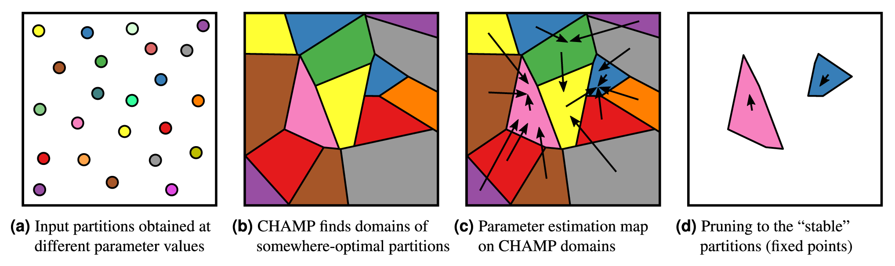

# ModularityPruning



ModularityPruning is a pruning tool to identify small subsets of network
partitions that are significant from the perspective of stochastic block model
inference. This method works for single-layer and multi-layer networks, as well
as for restricting focus to a fixed number of communities when desired.

See the [documentation](https://modularitypruning.readthedocs.io/en/latest/)
or the journal article at https://doi.org/10.1038/s41598-022-20142-6 for more
information.

Significantly more details can be found in the article's
[Supplementary Information](
https://static-content.springer.com/esm/art%3A10.1038%2Fs41598-022-20142-6/MediaObjects/41598_2022_20142_MOESM1_ESM.pdf
).

## Installation
This project is on [PyPI](https://pypi.org/project/modularitypruning/) and can
be installed with

    pip install modularitypruning
    # OR
    pip3 install modularitypruning

Alternatively, you can install it from this repository directly:

    git clone https://github.com/ragibson/ModularityPruning
    cd ModularityPruning
    python3 setup.py install

<a name = "Basic Usage"></a>
## Basic Usage

This package interfaces directly with python-igraph. A simple example of its
usage is

```python
import igraph as ig
from modularitypruning import prune_to_stable_partitions
from modularitypruning.leiden_utilities import repeated_leiden_from_gammas
import numpy as np

# get Karate Club graph in igraph
G = ig.Graph.Famous("Zachary")

# run leiden 1000 times on this graph from gamma=0 to gamma=2
partitions = repeated_leiden_from_gammas(G, np.linspace(0, 2, 1000))

# prune to the stable partitions from gamma=0 to gamma=2
stable_partitions = prune_to_stable_partitions(G, partitions, 0, 2)
print(stable_partitions)
``` 

This prints

    [(0, 0, 0, 0, 1, 1, 1, 0, 2, 2, 1, 0, 0, 0, 2, 2, 1, 0, 2, 0, 2, 0, 2, 3, 3, 3, 2, 3, 3, 2, 2, 3, 2, 2)]

which is the stable 4-community split of the Karate Club network.

## More Information

The [issues (which contains some potential future work)](https://github.com/ragibson/ModularityPruning/issues)
and [figure generation runtimes README](figure_generation_runtimes.md) may also
be of interest.
