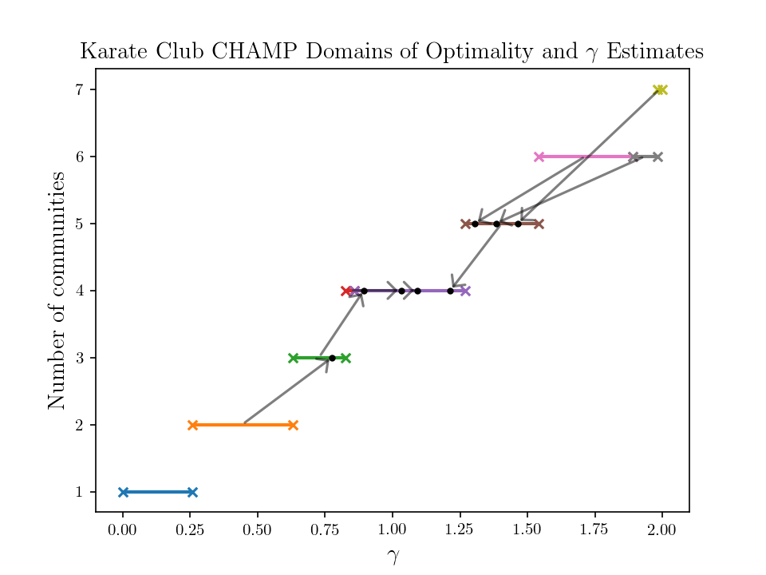
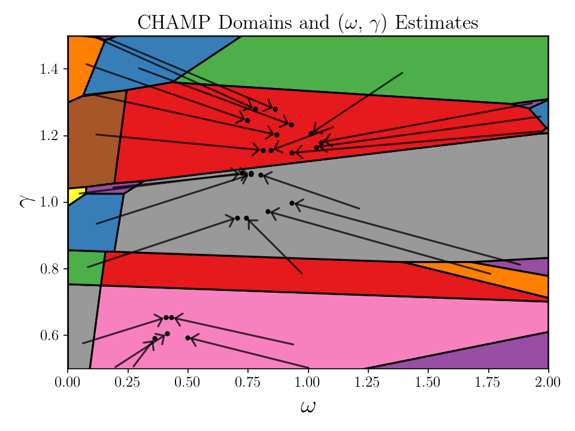
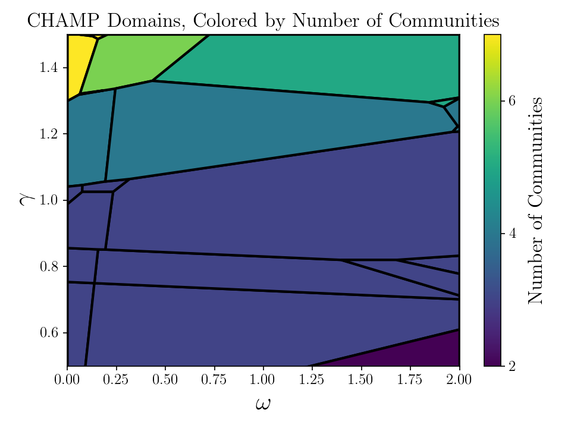
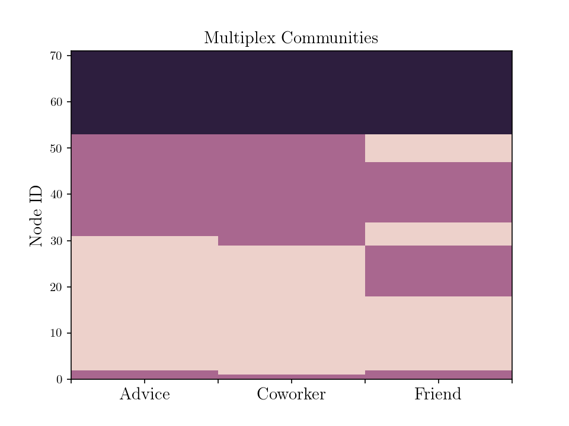

Plotting Examples
=================

We have included a few functions to generate plots of CHAMP domains and resolution parameter estimates in the
singlelayer and multilayer cases. We encourage you to make your own application-specific plotting code as well (the
source code in modularitypruning.plotting is very straightforward and may provide inspiration).

Plotting Single-Layer CHAMP Domains and Resolution Parameter Estimates
----------------------------------------------------------------------

.. autofunction:: modularitypruning.plotting.plot_estimates

An example on the Karate Club network is as follows.

.. code-block:: python

  import igraph as ig
  import matplotlib.pyplot as plt
  from modularitypruning.champ_utilities import CHAMP_2D
  from modularitypruning.parameter_estimation_utilities import ranges_to_gamma_estimates
  from modularitypruning.leiden_utilities import repeated_parallel_leiden_from_gammas
  from modularitypruning.plotting import plot_estimates
  import numpy as np

  # get Karate Club graph in igraph
  G = ig.Graph.Famous("Zachary")

  # run leiden 100K times on this graph from gamma=0 to gamma=2 (takes ~2-3 seconds)
  partitions = repeated_parallel_leiden_from_gammas(G, np.linspace(0, 2, 10 ** 5))

  # run CHAMP to obtain the dominant partitions along with their regions of optimality
  ranges = CHAMP_2D(G, partitions, gamma_0=0.0, gamma_f=2.0)

  # append gamma estimate for each dominant partition onto the CHAMP domains
  gamma_estimates = ranges_to_gamma_estimates(G, ranges)

  # plot gamma estimates and domains of optimality
  plt.rc('text', usetex=True)
  plt.rc('font', family='serif')
  plot_estimates(gamma_estimates)
  plt.title(r"Karate Club CHAMP Domains of Optimality and $\gamma$ Estimates", fontsize=14)
  plt.xlabel(r"$\gamma$", fontsize=14)
  plt.ylabel("Number of communities", fontsize=14)
  plt.show()

which generates

Plotting Multi-Layer CHAMP domains and Resolution Parameter Estimates
---------------------------------------------------------------------

.. autofunction:: modularitypruning.plotting.plot_2d_domains_with_estimates

An example on a realization of multilayer synthetic network in :doc:`../source/basic_multilayer_example` is as follows.

.. code-block:: python

  from modularitypruning.champ_utilities import CHAMP_3D
  from modularitypruning.leiden_utilities import repeated_parallel_leiden_from_gammas_omegas
  from modularitypruning.parameter_estimation_utilities import domains_to_gamma_omega_estimates
  from modularitypruning.plotting import plot_2d_domains_with_estimates
  import matplotlib.pyplot as plt
  import numpy as np

  # run leiden on a uniform grid (10K samples) of gamma and omega (takes ~3 seconds)
  gamma_range = (0.5, 1.5)
  omega_range = (0, 2)
  parts = repeated_parallel_leiden_from_gammas_omegas(G_intralayer, G_interlayer, layer_vec,
                                                      gammas=np.linspace(*gamma_range, 100),
                                                      omegas=np.linspace(*omega_range, 100))

  # run CHAMP to obtain the dominant partitions along with their regions of optimality
  domains = CHAMP_3D(G_intralayer, G_interlayer, layer_vec, parts,
                     gamma_0=gamma_range[0], gamma_f=gamma_range[1],
                     omega_0=omega_range[0], omega_f=omega_range[1])

  # append resolution parameter estimates for each dominant partition onto the CHAMP domains
  domains_with_estimates = domains_to_gamma_omega_estimates(G_intralayer, G_interlayer, layer_vec,
                                                            domains, model='temporal')

  # plot resolution parameter estimates and domains of optimality
  plt.rc('text', usetex=True)
  plt.rc('font', family='serif')
  plot_2d_domains_with_estimates(domains_with_estimates, xlim=omega_range, ylim=gamma_range)
  plt.title(r"CHAMP Domains and ($\omega$, $\gamma$) Estimates", fontsize=16)
  plt.xlabel(r"$\omega$", fontsize=20)
  plt.ylabel(r"$\gamma$", fontsize=20)
  plt.gca().tick_params(axis='both', labelsize=12)
  plt.tight_layout()
  plt.show()

which generates

There are other similar functions
  * :meth:`~modularitypruning.plotting.plot_2d_domains` essentially plots the above without arrows showing resolution
    parameter estimates
  * :meth:`~modularitypruning.plotting.plot_2d_domains_with_ami` plots CHAMP domains, colored by the AMI between each
    partition and a ground truth
  * :meth:`~modularitypruning.plotting.plot_2d_domains_with_num_communities` plots CHAMP domains, colored by number
    of communities

For example, the last function generates

Plotting Multiplex Community Structure of a Single Partition
------------------------------------------------------------

.. autofunction:: modularitypruning.plotting.plot_multiplex_community

An example from the Lazega Law Firm network is as follows

.. code-block:: python

  from modularitypruning.plotting import plot_multiplex_community
  import matplotlib.pyplot as plt
  import numpy as np

  num_layers = 3
  layer_vec = [i // 71 for i in range(num_layers * 71)]
  membership = [1, 1, 0, 0, 0, 0, 0, 0, 0, 0, 0, 0, 0, 0, 0, 0, 0, 0, 0, 0, 0, 0, 0, 0, 0, 0, 0, 0, 0, 0, 0, 1, 1, 1, 1,
                1, 1, 1, 1, 1, 1, 1, 1, 1, 1, 1, 1, 1, 1, 1, 1, 1, 1, 2, 2, 2, 2, 2, 2, 2, 2, 2, 2, 2, 2, 2, 2, 2, 2, 2,
                2, 1, 0, 0, 0, 0, 0, 0, 0, 0, 0, 0, 0, 0, 0, 0, 0, 0, 0, 0, 0, 0, 0, 0, 0, 0, 0, 0, 0, 0, 1, 1, 1, 1, 1,
                1, 1, 1, 1, 1, 1, 1, 1, 1, 1, 1, 1, 1, 1, 1, 1, 1, 1, 1, 2, 2, 2, 2, 2, 2, 2, 2, 2, 2, 2, 2, 2, 2, 2, 2,
                2, 2, 1, 1, 0, 0, 0, 0, 0, 0, 0, 0, 0, 0, 0, 0, 0, 0, 0, 0, 1, 1, 1, 1, 1, 1, 1, 1, 1, 1, 1, 0, 0, 0, 0,
                0, 1, 1, 1, 1, 1, 1, 1, 1, 1, 1, 1, 1, 1, 0, 0, 0, 0, 0, 0, 2, 2, 2, 2, 2, 2, 2, 2, 2, 2, 2, 2, 2, 2, 2,
                2, 2, 2]

  plt.rc('text', usetex=True)
  plt.rc('font', family='serif')
  ax = plot_multiplex_community(np.array(membership), np.array(layer_vec))
  ax.set_xticks(np.linspace(0, num_layers, 2 * num_layers + 1))
  ax.set_xticklabels(["", "Advice", "", "Coworker", "", "Friend", ""], fontsize=14)
  plt.title(f"Multiplex Communities", fontsize=14)
  plt.ylabel("Node ID", fontsize=14)
  plt.show()

which generates

